🚀🚀STILL IN PROCESS....🚀🚀

---

# **Property Management System**  

## **Overview**  
The **Property Management System** is a web-based application built using **React** and **Django** that facilitates property management for both **tenants (users)** and **landlords**. It provides a seamless experience for property booking, rental payments, and property management.  

## **Features**  

### **Tenant Dashboard (User)** 
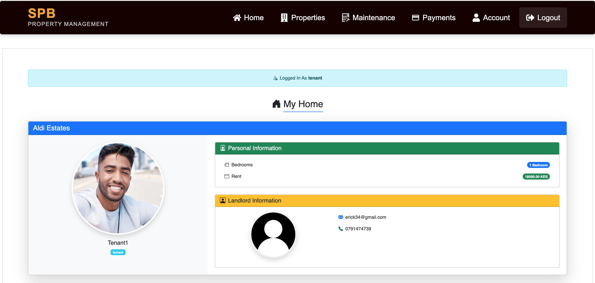 
- View all available properties 
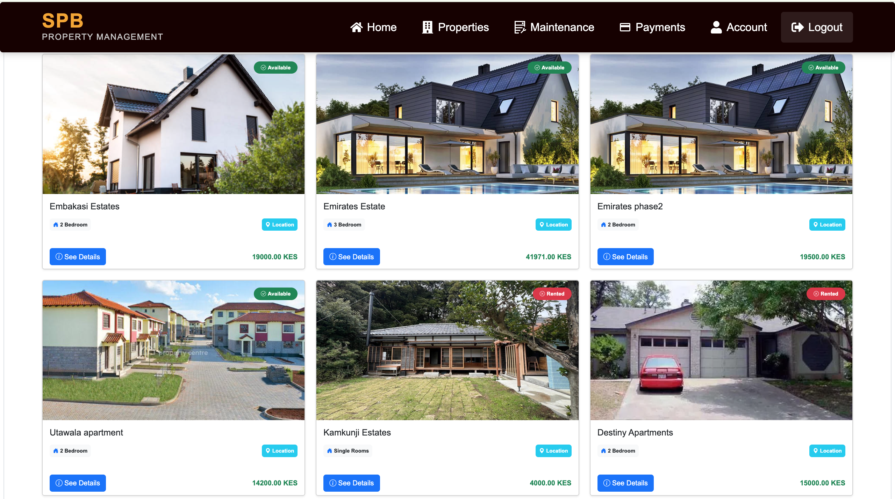 
- Book a property of choice 
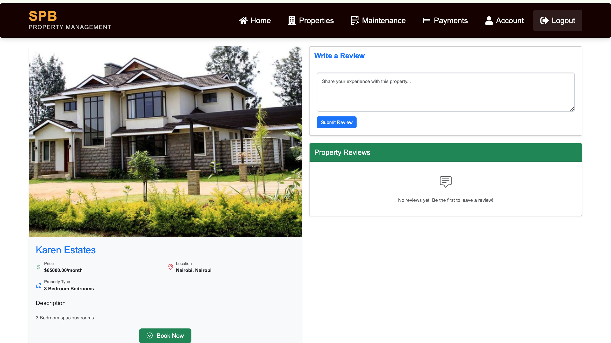 
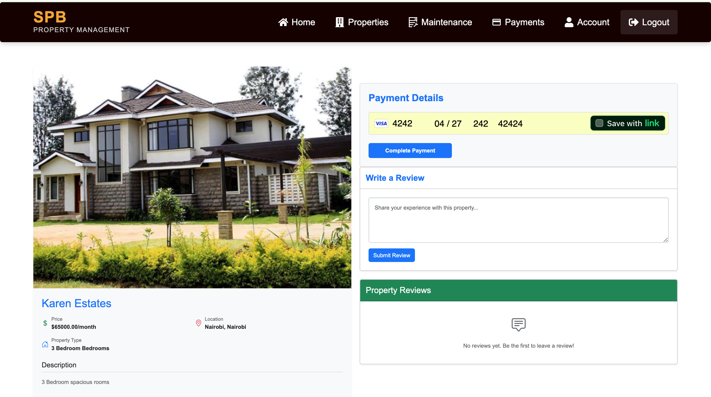
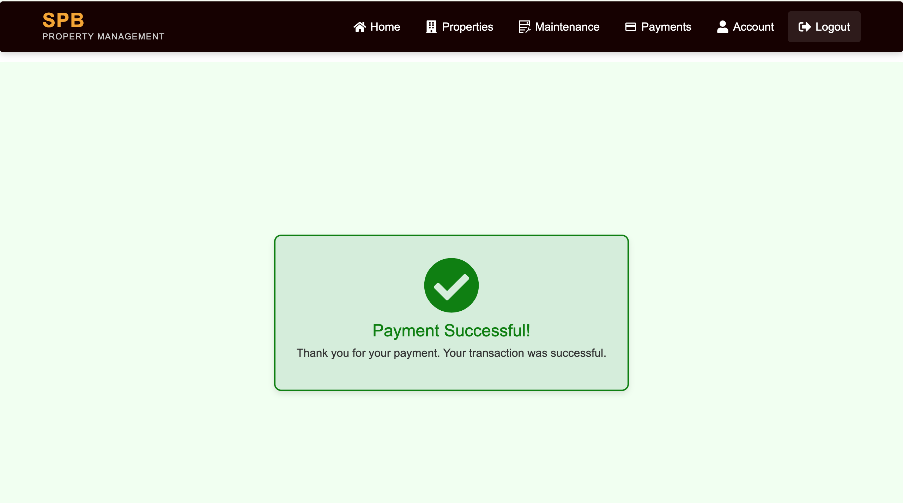
- Make monthly rental payments 
- Make a review of the property he/she has lived 
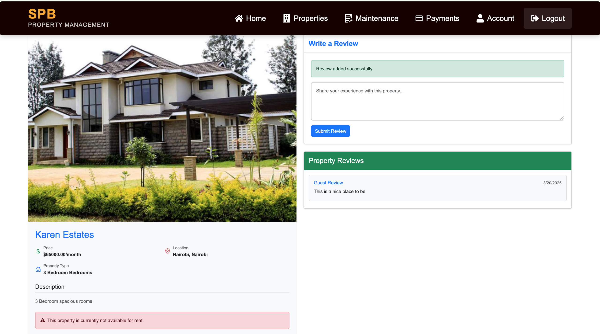

- View payment history  

### **Landlord Dashboard**  
 
 

- View tenant bookings  
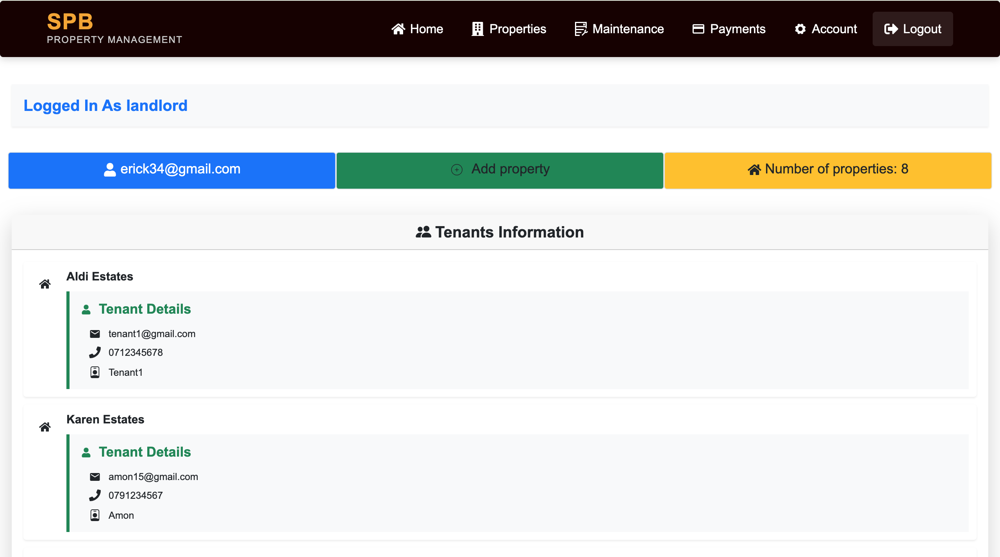
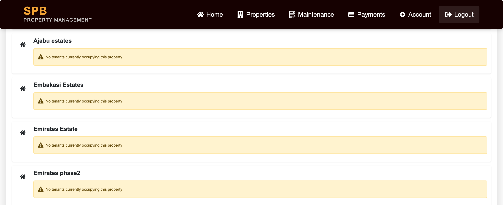
- Add new properties for rent 
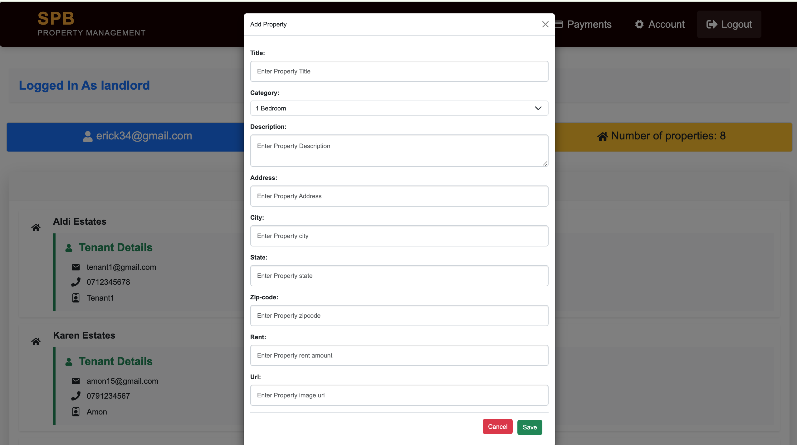

- View only their own listed properties 
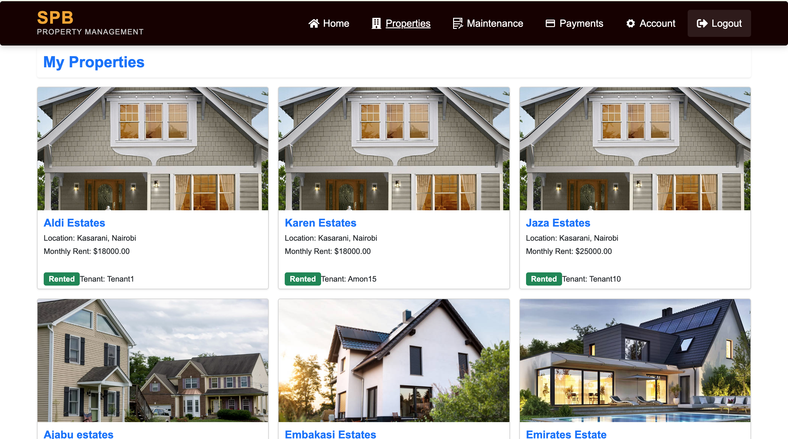
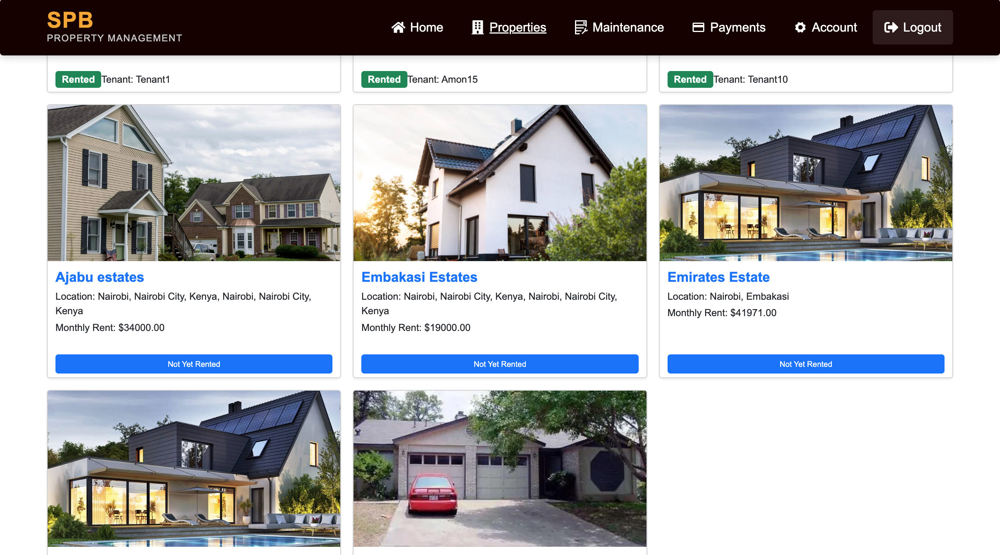
- Receive rental payments from tenants  

## **Tech Stack**  
- **Frontend:** React.js  
- **Backend:** Django & Django Rest Framework (DRF)  
- **Database:** PostgreSQL  
- **Authentication:** JWT-based authentication  
- **Payments:** Stripe for secure transactions  

## **Installation**  

### **Backend Setup (Django)**  
1. Clone the repository:  
   ```bash
   git clone https://github.com/your-repo/property-management.git
   cd property-management/backend
   ```  
2. Create a virtual environment and activate it:  
   ```bash
   python -m venv venv
   source venv/bin/activate  # Mac/Linux
   venv\Scripts\activate  # Windows
   ```  
3. Install dependencies:  
   ```bash
   pip install -r requirements.txt
   ```  
4. Apply migrations:  
   ```bash
   python manage.py migrate
   ```  
5. Start the backend server:  
   ```bash
   python manage.py runserver
   ```  

### **Frontend Setup (React)**  
1. Navigate to the frontend directory:  
   ```bash
   cd ../frontend
   ```  
2. Install dependencies:  
   ```bash
   npm install
   ```  
3. Start the development server:  
   ```bash
   npm start
   ```  

## **Usage**  
1. **Landlord Registration/Login**  
   - After logging in, landlords can add properties and view their own listings.  

2. **Tenant Registration/Login**  
   - Tenants can browse properties, book a property, and make payments.  

3. **Payments**  
   - Monthly payments are processed via Stripe, and landlords receive the amount in their accounts.  


## **License**  
This project is licensed under the **MIT License**.  

---

